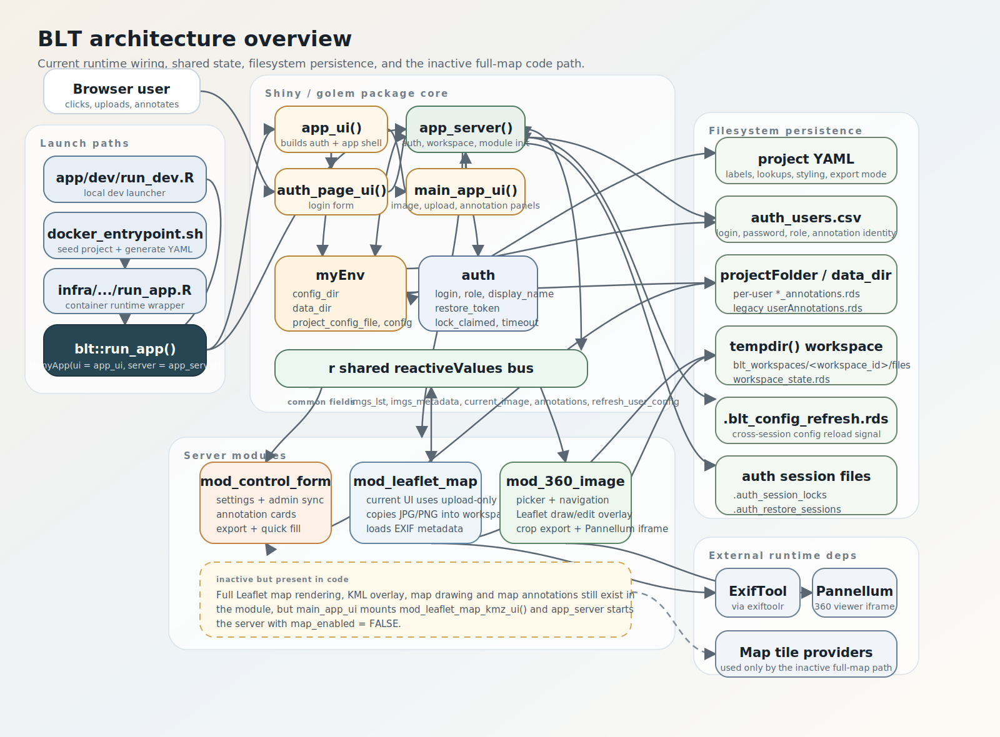
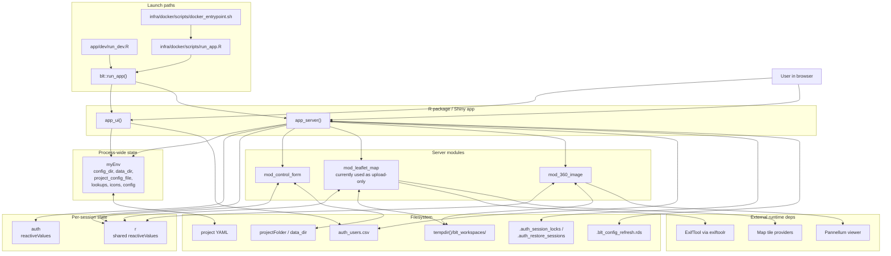
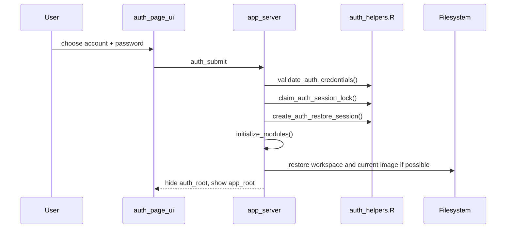
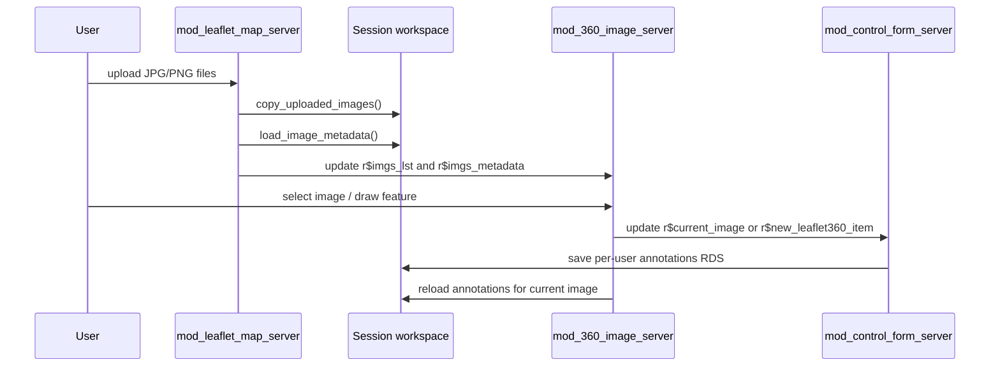
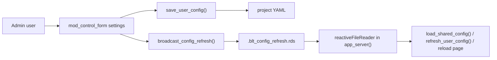

# BLT Architecture

This document describes how BLT is wired today: where the app starts, which modules are active, where state lives, and what calls what.

## 1. System Overview

## 2. Main Entry Points

1. `app/dev/run_dev.R`
   Loads the package from source and calls `blt::run_app()` for local development.
2. `infra/docker/scripts/docker_entrypoint.sh`
   Seeds `/data/project`, generates a project YAML from `container-project-settings.yml`, copies `auth_users.csv`, then calls `infra/docker/scripts/run_app.R`.
3. `app/R/run_app.R`
   Creates `shinyApp(ui = app_ui, server = app_server)` and wraps it in `golem::with_golem_options(...)`.

## 3. Startup And Configuration

There are two configuration modes:

- Default mode:
  `.onLoad()` initializes a default YAML in the user's R config directory and a default data directory.
- Project mode:
  `run_app(projectSettingsFile = ...)` makes `app_ui()` call `was_projectSettingsFile_passed_in()`, which repoints `myEnv$config_dir`, `myEnv$data_dir`, and `myEnv$project_config_file` to the project-specific folder.

Important detail:

- `myEnv` is global, process-wide mutable state.
- `auth` is per-browser-session authentication state.
- `r` is the shared reactive bus passed into all server modules.

## 4. What Calls What

### Top level

- `run_app()`
  calls `app_ui` and `app_server`.
- `app_ui()`
  calls `was_projectSettingsFile_passed_in()`, `load_auth_users()`, `auth_page_ui()`, `main_app_ui()`, and `golem_add_external_resources()`.
- `app_server()`
  calls `create_session_state()`, auth/session helpers, config refresh helpers, and lazily initializes:
  - `mod_control_form_server("control_form", r)`
  - `mod_leaflet_map_server("leaflet_map", r, map_enabled = FALSE)`
  - `mod_360_image_server("pano360_image", r)`

### Module layer

- `mod_control_form_server()`
  owns settings, annotation-card UI, annotation-file export, quick-fill, and writes per-user annotation files.
- `mod_leaflet_map_server()`
  is currently used mainly to ingest uploaded images into the session workspace and load EXIF metadata.
  The full map/drawing logic still exists in the module, but `main_app_ui()` mounts the reduced `mod_leaflet_map_kmz_ui()` and `app_server()` starts the server with `map_enabled = FALSE`.
- `mod_360_image_server()`
  owns image selection, Pannellum iframe rendering, 2D drawing overlay on the current image, and crop export.

### Helper layer

- `fct_helpers.R`
  contains the operational helpers: image copy/load, EXIF, annotation persistence, Leaflet rendering, icon creation, and crop export.
- `auth_helpers.R`
  contains CSV-backed auth, account locking, session restore, and session timeout bookkeeping.
- `app_config.R`
  contains workspace-path management, config-refresh signaling, and default YAML creation.

## 5. Shared Reactive Bus `r`

The three modules do not call each other directly. They coordinate through the shared `r` object created in `app_server()`.

| `r` field | Produced by | Consumed by |
| --- | --- | --- |
| `r$imgs_lst` | `mod_leaflet_map_server()` after upload | `mod_360_image_server()` |
| `r$imgs_metadata` | `mod_leaflet_map_server()` | `mod_360_image_server()`, restore logic |
| `r$current_image` | image picker in `mod_360_image_server()`, workspace restore, optional map click path | `app_server()`, `mod_control_form_server()`, `mod_360_image_server()`, optional map path |
| `r$new_leafletMap_item` | whole-image annotation button, optional map draw path | `mod_control_form_server()`, optional map redraw path |
| `r$new_leaflet360_item` | 360 draw toolbar | `mod_control_form_server()`, 360 redraw path |
| `r$remove_leafletMap_item` | form delete action | optional map cleanup path |
| `r$remove_leaflet360_item` | form delete action | 360 cleanup path |
| `r$user_annotations_data` | form creation/edits, geometry edit events | form reload, 360 redraw, optional map redraw, export |
| `r$user_annotations_file_name` | auth-aware form init | save/export helpers |
| `r$refresh_user_config` | settings changes in form | form refresh, optional map refresh, 360 refresh |

## 6. Main Runtime Flows

### Authentication flow

### Image upload to annotation flow

### Admin settings propagation flow

## 7. Persistence Model

BLT is file-based. There is no database.

Persistent or semi-persistent files:

- Project YAML:
  app settings, lookup file names, labels, export format, styling.
- `auth_users.csv`:
  account list, role, password, annotation identity.
- `<login>_annotations.rds`:
  per-user annotation storage.
- `userAnnotations.rds`:
  legacy annotation file still supported for migration.
- `.auth_session_locks/`:
  prevents the same account from being used in two active sessions.
- `.auth_restore_sessions/`:
  allows browser refresh/session restore within the timeout window.
- `tempdir()/blt_workspaces/<workspace_id>/files`:
  uploaded session images.
- `workspace_state.rds`:
  remembers the last selected image for that workspace.

## 8. Current Implementation Notes

1. The app is still structurally a `golem` package, but much of the runtime state is managed through a mutable global `myEnv` plus per-session `r`.
2. Full map annotation support exists in code, but the current UI only mounts the upload-only version of the map module.
3. Cross-session config sync is implemented with a watched `.rds` signal file, not with a message bus or database.
4. Auth is local CSV + filesystem locks, not OAuth/LDAP/etc.
5. Crop export is generated from 360 polygon annotations by rendering image subsets and writing GPS EXIF metadata back into the exported PNG files.
